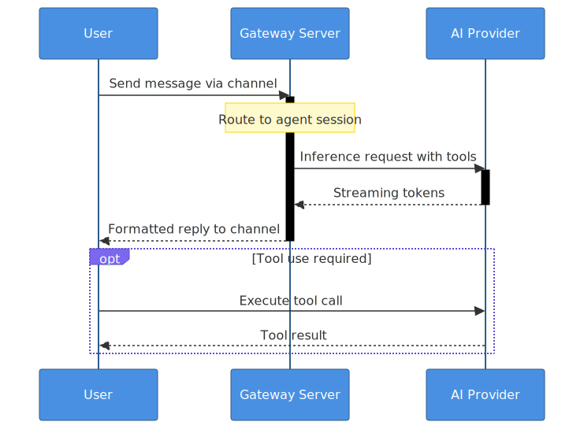

# Chapter 2: The OpenClaw Ecosystem

## Introduction

In the preceding chapter, we established the core principles of AI-native development and introduced the taxonomy of patterns that separate systems designed for AI from those merely augmented by it. We explored how pragmatism, human-centricity, and community-driven evolution shape these principles—not as theoretical constructs, but as hard-won lessons from building real systems. Now we move from principle to practice. This chapter is a guided tour of the OpenClaw ecosystem as it exists today: its philosophy, its architecture under the hood, the full range of channels it speaks, and the concrete steps to get it running on your own hardware.

OpenClaw is best understood as a **self-hosted personal AI platform**. Its npm package description captures it tersely: *"Multi-channel AI gateway with extensible messaging integrations."* What that means in practice is a persistent Gateway process running on your machine that connects every messaging platform you already use—WhatsApp, Telegram, Discord, Slack, Signal, iMessage, Microsoft Teams, and a dozen more—to an AI agent runtime that you control entirely. No cloud lock-in, no subscription required beyond the AI model provider you choose. The Gateway is the control plane; the product is the assistant.

This chapter deconstructs that architecture layer by layer: the Gateway at the center, the agents it runs, the skills that give them capabilities, the channels that connect them to the world, and the deployment models that fit everything from a laptop to a cloud cluster. Along the way we'll see exactly how the patterns from Chapter 1 manifest in code, configuration, and community practice.

## 2.1 OpenClaw Philosophy and History

Every durable open-source project carries a philosophy embedded in its earliest design decisions. OpenClaw's philosophy is readable in its monorepo structure as clearly as in any written manifesto.

### Origin Story and Core Philosophy

OpenClaw began as a personal project to escape the ceiling of stateless AI chat sessions. The early insight was that the power of an AI assistant lies not in a single, omniscient model but in its ability to coordinate a diverse set of specialized tools across time, remembering context from one day to the next and acting proactively between conversations. Early versions were monolithic and brittle, but they established the core thesis: **pragmatic, human-centric AI assistance**.

Three ideas underpin every architectural decision:

1. **Pragmatism over purity.** The system prioritizes working solutions over theoretically elegant ones. Its file-based memory system (`MEMORY.md`, daily `.md` logs) is a perfect example: a database would be more query-efficient, but a markdown file is readable, editable, and version-controllable by any human or AI. The system picks what works in practice.

2. **Human-centricity.** OpenClaw augments human capabilities rather than replacing them. Every agent action is logged and inspectable. The human is always able to read the transcript, edit memory files directly, or override behavior by modifying `SOUL.md`. Transparency is a first-class feature, not an afterthought.

3. **Assistance as the frame.** The system is designed as a partner, not an oracle. This shapes everything from the language used in its interfaces to the design of its safety guardrails—the assistant helps you do your work, and you remain the one accountable for outcomes.

### Design Principles

These philosophical commitments produce three concrete design principles visible throughout the codebase:

- **Simplicity.** The Micro-Skill Architecture Pattern promotes small, single-purpose skills that are individually trivial but composable into sophisticated behavior. There are no sprawling class hierarchies or abstract plugin frameworks—a skill is a directory with a `SKILL.md` file.

- **Composability.** Every layer is designed to combine: skills chain together, tools compose into workflows, agents coordinate through the Gateway, and channels aggregate into a unified inbox. Complexity emerges from the combination of simple parts.

- **Extensibility.** The Skill Blueprint Pattern ensures new capabilities can be added in a standardized way. The channel plugin system means any new messaging platform can be integrated without touching the core Gateway. The system grows at the edges.

### Project Governance

OpenClaw follows a "benevolent dictator" model: a project founder who provides ultimate direction, supported by maintainer teams responsible for specific subsystems—Gateway core, channel extensions, documentation, and the skills registry. This mirrors the AI-First Contribution Pattern from Chapter 1, with specialized reviewers ensuring quality while keeping the overall vision coherent.

## 2.2 Core Architecture Components



The OpenClaw repository is a **pnpm workspace monorepo**. Understanding its layout is the fastest path to understanding the system's design:

| Path | Purpose |
|------|---------|
| `.` (root) | Core Gateway, CLI, agent runtime, channel integrations |
| `ui/` | Control UI — Vite + LitElement browser dashboard |
| `extensions/*` | Channel plugins (telegram, discord, slack, whatsapp, signal, matrix, msteams, etc.) |
| `apps/ios/` | iOS native node app (`ai.openclaw.ios`, Swift) |
| `apps/macos/` | macOS native node app (`ai.openclaw.mac`, Swift) |
| `apps/android/` | Android native node app (`ai.openclaw.android`, Kotlin/Compose) |
| `packages/*` | Internal packages (`clawdbot`, `moltbot`, etc.) |

Every subsystem connects to the single Gateway process at the center. Nothing communicates peer-to-peer.

### 2.2.1 The Gateway: Central Nervous System



At the heart of OpenClaw is the Gateway (`GatewayServer`, implemented in `message-handler.ts`). It is the canonical implementation of the **Gateway-Mediated Multi-Agent Pattern**: a single always-on process that manages all sessions, routes all messages, enforces all tool policies, and orchestrates all agents. No component communicates with another except through the Gateway.

The Gateway exposes **one multiplexed port** (default: `18789`) that serves three distinct surfaces simultaneously:

- **WebSocket RPC** — all control traffic from the CLI, Control UI, channel plugins, and native node apps
- **HTTP APIs** — `POST /tools/invoke` for external tool calls, and an OpenAI-compatible API surface for third-party integrations
- **Served assets** — the Control UI single-page application (SPA)

This design—everything on one port—dramatically simplifies deployment. There is no internal service mesh to configure, no port matrix to manage. A single firewall rule, a single reverse-proxy entry.

The Gateway's responsibilities, mapped to implementation:

| Responsibility | Implementation |
|---|---|
| Session management | `sessions.json` + per-session transcript `.jsonl` files |
| Configuration | `~/.openclaw/openclaw.json` (JSON5), Zod schema validation, hot-reload |
| Channel coordination | Per-channel monitor → inbound dispatch → agent runtime |
| Agent execution | `@mariozechner/pi-coding-agent` (`runReplyAgent` / `runEmbeddedPiAgent`) |
| Cron scheduling | `CronJob` records, managed via `cron.*` RPC namespace |
| Auth enforcement | Token, password, device identity, Tailscale header validation |
| Memory indexing | `MemorySearchManager` — SQLite (default) or LanceDB backend |

**The WebSocket RPC protocol** uses three frame types defined in `protocol.schema.json`:

- `RequestFrame` (client → server): invoke a named RPC method
- `ResponseFrame` (server → client): return value for a request
- `EventFrame` (server → client): push event (agent output, session changes, streaming tokens)

RPC methods are grouped by subsystem namespace:

```
agent.*    →  agent.run, agent.identity, agent.wait
chat.*     →  chat.history, chat.send, chat.abort, chat.inject
sessions.* →  sessions.list, sessions.patch, sessions.reset, sessions.delete
cron.*     →  cron.add, cron.update, cron.remove, cron.run
config.*   →  config.get, config.apply, config.patch
nodes.*    →  nodes.status, nodes.invoke
mesh.*     →  multi-gateway routing
```

This structured RPC surface means that the CLI, the browser Control UI, and native apps all speak the same protocol to the same Gateway. Adding a new management tool requires implementing this protocol—nothing else.

**Gateway port resolution** follows the Environment-First Configuration Pattern precisely:

```
--port CLI flag
  → OPENCLAW_GATEWAY_PORT environment variable
    → gateway.port in openclaw.json
      → default: 18789
```

**Hot reload modes** let operators control how the Gateway handles configuration changes without restarting:

| Mode | Behavior |
|------|----------|
| `off` | No config reload |
| `hot` | Apply only hot-safe changes live |
| `restart` | Full restart on any reload-required change |
| `hybrid` (default) | Hot-apply when safe, graceful restart when not |

The `hybrid` default provides the best operational balance: routine changes (adding a cron job, tweaking a skill) apply instantly; structural changes (new channel configuration, gateway auth changes) trigger a controlled restart.

### 2.2.2 Agents: Specialized Personalities

An agent in OpenClaw is an isolated conversational context with its own workspace directory, session history, system prompt, and tool access. The agent runtime is built on `@mariozechner/pi-coding-agent`, a library that handles the turn-by-turn AI execution loop—reading tools, streaming responses, and managing the message history that gets sent to the model.

Each agent has:

- **A workspace directory** (default: `~/.openclaw/workspace`) containing the agent's identity and memory files: `AGENTS.md`, `SOUL.md`, `MEMORY.md`, and injected context files that the Gateway assembles into the system prompt for each turn.
- **A session store** — conversations persisted in `sessions.json` with full transcript `.jsonl` files for each session. Sessions persist across process restarts.
- **A model configuration** — a primary model plus a fallback chain. If the primary provider is rate-limited or unavailable, the agent automatically tries the next provider. Supported backends include Anthropic, OpenAI, OpenRouter, Google Gemini, Ollama, MiniMax, AWS Bedrock, and any OpenAI-compatible API.
- **A tool set** — exec, browser, memory search, subagent spawning, filesystem operations, message sending, and more—exactly what the chapter on tools will cover in depth.

OpenClaw supports three agent roles:

- **Main agent:** The primary interactive assistant. Users interact with it through any channel. It has access to the broadest tool set and maintains long-term memory.
- **Sub-agents:** Spawned by the main agent to handle complex, long-running, or parallel tasks. Each sub-agent operates in its own isolated session but auto-announces completion back to the parent. This is the pattern used to write this book—parallel sub-agents distributed the writing workload across chapters simultaneously.
- **Cron agents:** Scheduled agents triggered by the Gateway's cron service (`cron.*` RPC). Used for routine tasks: daily email summaries, periodic health checks, proactive reminders. They run without user interaction.

**Multi-agent isolation** is enforced by the Gateway: each agent has its own workspace, and sub-agents cannot directly access the main agent's memory or session. Communication flows through structured completion messages, not shared state. This prevents the cascading context corruption that plagues ad-hoc multi-agent systems.

### 2.2.3 Skills: Extensible Capabilities

Skills are how agents acquire specialized behaviors. If the Gateway is the nervous system, skills are the acquired knowledge—a specific skill teaches the agent how to accomplish a particular kind of task, what tools to use, what precautions to take, and what a good result looks like.

OpenClaw's skill system is **AgentSkills-compatible** (the open spec at agentskills.io). Every skill is a directory containing a `SKILL.md` file with YAML frontmatter and structured instructions. Nothing more is required—no compiled code, no registered plugins, no restart.

**Three skill locations** with explicit precedence rules:

```
<workspace>/skills        ← highest priority (per-agent)
~/.openclaw/skills        ← shared across all agents on the machine
bundled skills            ← shipped with the npm package (lowest)
```

If the same skill name exists in multiple locations, the workspace wins. This lets you override a bundled skill with a customized version for a specific agent, without touching the shared installation.

Additional directories can be added via `skills.load.extraDirs` in `openclaw.json`:

```json
{
  "skills": {
    "load": {
      "extraDirs": ["/opt/company-skills", "~/shared-skills"]
    }
  }
}
```

**The SKILL.md format** requires at minimum a `name` and `description` in YAML frontmatter. The `metadata` field enables load-time gating:

```markdown
---
name: weather-check
description: Get current weather and forecasts for any location
metadata: {"openclaw": {"requires": {"env": ["OPENWEATHER_API_KEY"]}, "primaryEnv": "OPENWEATHER_API_KEY", "emoji": "🌤"}}
user-invocable: true
---

# Weather Check Skill

## Overview
Fetches current conditions and forecasts from OpenWeatherMap. Formats results
for the current channel (concise for mobile, detailed for desktop).

## Workflow
1. Parse location from the user's message
2. Call the OpenWeatherMap API using the `web_fetch` tool
3. Format results appropriate to channel width and user preferences

## Examples
- "What's the weather in Tokyo right now?"
- "Will it rain in London this weekend?"
- "Give me a 5-day forecast for São Paulo"

## Guardrails
- Never store API keys in responses or logs
- Rate-limit to 10 requests per minute across all agents
- Always include units (°C or °F) based on user locale
```

**Gating metadata fields** control when a skill is loaded:

| Field | Effect |
|-------|--------|
| `requires.bins` | Skip if these binaries aren't present (e.g., `["ffmpeg"]`) |
| `requires.env` | Skip if these environment variables are unset |
| `requires.config` | Skip if these gateway config keys are absent |
| `always: true` | Always load, bypassing all gates |

This means a skill that needs `ffmpeg` for video processing simply won't appear in agents running on machines without it, rather than loading and failing at runtime.

**ClawHub** is the public skills registry at `clawhub.com`. It's the skill marketplace that the ecosystem has built around the Skill Blueprint Pattern:

```bash
# Install a skill from ClawHub into your workspace
clawhub install weather-check

# Update all installed skills to latest versions
clawhub update --all

# Publish your own skill to ClawHub
clawhub publish ./skills/my-skill

# Sync and verify all installed skills
clawhub sync --all
```

Skills installed via `clawhub` land in `<workspace>/skills`, making them immediately available without any Gateway restart. The combination of the standardized SKILL.md format and ClawHub creates the virtuous cycle described in Chapter 1's Community-Driven Evolution principle: more users means more contributed skills, which makes the platform more capable, which attracts more users.

### 2.2.4 Tools: Universal Interface

Tools are the primitive operations that skills compose into workflows. They form a standardized interface between the agent's reasoning and the outside world. The core toolset available to all agents includes:

- `read` — read file contents
- `write` — create or overwrite files
- `edit` — perform precise surgical edits (find-and-replace within files)
- `exec` — run shell commands (with optional PTY for interactive CLIs)
- `message` — send messages through any configured channel
- `browser` — control a Chromium-based browser for web automation and scraping
- `web_search` — perform web searches via configured search APIs
- `web_fetch` — fetch and extract content from URLs
- `canvas` — control the Live Canvas visual workspace (macOS)
- `nodes` — invoke capabilities on paired native devices (camera, screen, location, voice)
- `subagents` — list, steer, or terminate spawned sub-agents
- `tts` — convert text to speech via ElevenLabs



**Tool policies** provide fine-grained access control. Each agent's configuration can specify which tools it may use and with what parameters. For example, a cron monitoring agent might require human approval before every `exec` command (via `ask: "always"`), while a trusted automation agent runs without prompting. This is the principle of least privilege applied to AI tool usage:

```json
{
  "agents": {
    "cron-monitor": {
      "tools": {
        "exec": { "ask": "always" },
        "write": { "deny": true }
      }
    }
  }
}
```

The `exec` tool's `ask` parameter is particularly important for security: setting it to `"always"` causes the agent to request human approval before running any shell command, providing a human-in-the-loop checkpoint for sensitive operations.

### 2.2.5 Channels: Communication Interfaces

Channels are the bridges between OpenClaw and the messaging platforms users already live in. The channel architecture is deliberately extensible: each channel runs as a plugin that monitors a platform-specific event stream, normalizes inbound messages to a common internal format, dispatches them to the Gateway's agent runtime, and translates the agent's reply back to platform-native formatting.

As of v2026.2.27, OpenClaw supports **17 messaging channels**:

| Channel | Extension Package | Notes |
|---------|-------------------|-------|
| Telegram | `extensions/telegram` | grammY SDK |
| Discord | `extensions/discord` | discord.js + slash commands |
| WhatsApp | `extensions/whatsapp` | Baileys library (QR pairing) |
| Slack | `extensions/slack` | Bolt SDK (socket mode + HTTP) |
| Signal | `extensions/signal` | signal-cli bridge |
| iMessage (BlueBubbles) | built-in | Recommended iMessage path |
| iMessage (legacy) | `extensions/imessage` | macOS only, via `imsg` |
| Matrix | `extensions/matrix` | matrix-bot-sdk |
| Feishu / Lark | `extensions/feishu` | Lark Node SDK |
| Microsoft Teams | `extensions/msteams` | Bot Framework |
| Google Chat | `extensions/googlechat` | Chat API webhook |
| IRC | `extensions/irc` | — |
| Mattermost | `extensions/mattermost` | — |
| Zalo | `extensions/zalo` | — |
| LINE | `extensions/line` | — |
| Nextcloud Talk | `extensions/nextcloud-talk` | — |
| WebChat | built-in | Served directly by the Gateway |

This breadth has a practical consequence for the AI-native development patterns we discussed in Chapter 1: an OpenClaw agent responds to the same underlying message regardless of whether it arrived via Telegram, Discord, or iMessage. Skills are written once and work everywhere. The `message` tool's `channel` parameter lets a skill send a reply to a specific platform when needed, but the default behavior is channel-agnostic.

**Channel-specific adaptations** do exist. Chapter 3 will show examples of skills that detect the current channel and adjust formatting accordingly—suppressing markdown tables on WhatsApp, using embed cards on Discord, keeping responses terse on SMS-style channels. But these are optimizations layered on top of a channel-neutral core.

**DM Security Policy** controls how each channel handles messages from unknown senders:

```json
{
  "channels": {
    "telegram": { "dmPolicy": "pairing" },
    "discord":  { "dmPolicy": "pairing" }
  }
}
```

The default `"pairing"` policy sends unknown contacts a one-time pairing code. Only after they respond with the correct code—and you run `openclaw pairing approve`—does their account get added to the allowlist and their messages processed by the agent. Setting `"open"` allows any sender, which is appropriate for public-facing bots but requires explicit opt-in for exactly that reason.

## 2.3 Deployment Models

The flexibility of OpenClaw's architecture supports a spectrum of deployment scenarios, from a single developer's laptop to a multi-user cloud deployment. The consistent application of the **Environment-First Configuration Pattern** ensures that an agent configured in one environment can be moved to another with minimal changes.



### 2.3.1 Local Deployment

The most common setup is a single-machine deployment for personal use. The Gateway runs as a background daemon (launchd on macOS, systemd on Linux), starting automatically with the machine and persisting through reboots.

**Typical resource footprint:** The Gateway itself is lightweight—a Node.js process consuming 100–200 MB of RAM at rest. The dominant cost is AI model inference, which is borne by your chosen provider's API. A typical interactive session costs fractions of a cent per exchange with Claude or GPT-4 class models.

**Security for local deployment:** The Gateway binds to loopback (`127.0.0.1`) by default—it is not accessible from the network. Remote access requires either Tailscale/VPN (preferred) or an explicit SSH tunnel:

```bash
# Access a remote OpenClaw from a local client via SSH tunnel
ssh -N -L 18789:127.0.0.1:18789 user@myserver
# Then connect clients to ws://127.0.0.1:18789 locally
```

**Operator essentials:**

```bash
openclaw gateway status          # check if Gateway is running
openclaw gateway status --deep   # detailed subsystem status
openclaw logs --follow           # tail the Gateway log stream
openclaw doctor                  # security + misconfiguration audit
openclaw secrets reload          # reload secrets without restart
```

### 2.3.2 Cloud Deployment

For teams or organizations, OpenClaw can be deployed to a cloud server or VPS. The architecture supports multi-user scenarios through **multi-agent routing**: different inbound channels, accounts, or peers can be routed to isolated agents with separate workspaces, sessions, and tool policies.

**Scalability considerations:** The Gateway is designed as a single-process control plane. In high-traffic scenarios, the bottleneck is typically model inference latency rather than Gateway throughput—the Gateway itself handles thousands of RPC operations per second. Scaling model inference means choosing providers with higher rate limits or routing to multiple providers via the failover chain.

**Cost management:** The model fallback chain is a natural cost optimization lever. Configure an expensive frontier model (Anthropic Claude Opus) as the primary for complex reasoning tasks, with a cheaper model (Haiku, GPT-4o-mini, or a local Ollama instance) as the fallback for simpler queries. The Gateway routes each turn to the appropriate tier automatically.

**Monitoring:** The `config.get` and `agent.*` RPC endpoints expose runtime telemetry. Production deployments typically combine `openclaw gateway status --json` with a scraper that exports Gateway health metrics to Prometheus or equivalent. Chapter 10 covers this observability integration in detail.

### 2.3.3 Hybrid Approaches

OpenClaw's loopback-first design and Tailscale integration enable hybrid configurations that mix local and cloud execution cleanly.

**Edge + cloud split:** Run the Gateway on local hardware for data sovereignty—sensitive files stay on your machine, private conversations stay private. Offload computationally intensive tasks to cloud-based model providers only when needed. The agent runs locally; only the inference calls leave the machine.

**Multi-gateway mesh:** The `mesh.*` RPC namespace enables routing between multiple Gateway instances. An organization might run a shared cloud Gateway for team channels (Slack, Teams) while each team member runs a personal local Gateway for private assistant interactions. The mesh routes between them.

**Redundancy:** A hybrid setup provides natural failover. If the cloud Gateway is unreachable, the local instance continues operating with its local capabilities. If the local machine is offline, cloud cron agents continue running scheduled tasks.

## 2.4 Ecosystem and Community

OpenClaw is more than a codebase—it's a growing ecosystem of developers, contributors, and users who collectively define what the platform becomes.



### 2.4.1 GitHub Ecosystem

The repository at `github.com/openclaw/openclaw` is the hub of technical activity. The monorepo structure—Gateway core plus extensions plus native apps—means the vast majority of contribution activity is visible in one place, which concentrates community knowledge rather than scattering it across many repos.

The contribution process explicitly welcomes AI-assisted work with disclosure, embodying the **AI-First Contribution Pattern** from Chapter 1. This isn't just a policy statement—the maintainer review system is structured around it, with reviewers who specialize in particular subsystems (Gateway, channels, skills, documentation) rather than generalist code review. A specialist reviewer for the Telegram extension understands the nuances of grammY's event model; a Gateway reviewer knows the Zod configuration schema backward and forward.

### 2.4.2 Community Channels

The Discord server (`discord.gg/clawd`) is the primary gathering place for real-time discussion. It's organized into channels by topic: general usage, skill development, channel integration, AI model configuration, and the inevitable help desk for setup issues. The culture is notably collaborative—experienced users frequently debug newcomers' configuration problems, creating a knowledge-sharing dynamic that accelerates adoption.

Telegram groups serve for announcements and lighter conversation. For those who prefer async, GitHub Discussions hosts longer-form technical conversations about architecture decisions and roadmap proposals.

### 2.4.3 ClawHub: The Skills Registry

ClawHub (`clawhub.com`) is the formalized skill marketplace. The standardized Skill Blueprint Pattern makes it possible: because every skill has a machine-readable `SKILL.md` with consistent frontmatter, ClawHub can index skills, check their gating requirements, and present users with a filtered list of skills that will actually work on their setup.

Skills on ClawHub are versioned and have metadata for:
- **Dependencies:** other skills or system tools required
- **Gating requirements:** environment variables and config keys
- **Compatibility:** minimum OpenClaw version, platform restrictions
- **Community ratings:** user feedback aggregated from the Discord

A skill author can publish to ClawHub with a single command (`clawhub publish`), and users can install and update with `clawhub install <slug>`. This lifecycle—develop, test locally, publish, maintain, install—is the community's equivalent of npm for AI capabilities.

## 2.5 Installation and Setup Walkthrough

Let's walk through getting OpenClaw running. This section highlights the practical application of the **Environment-First Configuration Pattern** and the project's emphasis on a smooth first-run experience through the onboarding wizard.

### 2.5.1 Prerequisites and Requirements

Before installing, ensure you have:

- **Runtime:** Node.js >= 22 (check with `node --version`)
- **Package manager:** npm, pnpm, or bun (pnpm is preferred for source builds)
- **API key(s):** At least one AI model provider (Anthropic, OpenAI, Google, etc.)
- **Network:** Outbound HTTPS to your chosen model provider APIs
- **Storage:** ~500 MB for the package; sessions and memory files grow over time (~10–50 MB/month for typical personal use)

**Recommended model:** Anthropic Pro/Max subscription with Claude Opus 4.6. The docs recommend it specifically for long-context strength and better prompt injection resistance—qualities that matter when an agent processes inbound messages from external channels.

### 2.5.2 Step-by-Step Installation

```bash
# 1. Install the OpenClaw package globally
npm install -g openclaw@latest
# or: pnpm add -g openclaw@latest

# 2. Run the interactive onboarding wizard
#    This guides you through: Gateway setup, workspace init,
#    channel configuration, and skill selection
openclaw onboard --install-daemon
```

The `--install-daemon` flag installs the Gateway as a supervised system service (launchd on macOS, systemd on Linux). This means the Gateway starts automatically with your machine and restarts if it crashes—essential for an always-on assistant.

The wizard covers every step interactively: it prompts for your API keys, helps you connect your first channel (Telegram is the recommended starting point), and lets you select an initial skill pack. When you exit the wizard, the Gateway is running and your first channel is connected.

**Verify the installation:**

```bash
openclaw gateway status     # should show: Runtime: running, RPC probe: ok
openclaw channels status --probe   # shows connected channels and their health
```

**Updating:**

```bash
# Stay on the stable channel (recommended)
openclaw update --channel stable

# After any major update, run the health check
openclaw doctor
```

### 2.5.3 Initial Configuration

All runtime configuration lives in `~/.openclaw/openclaw.json` (JSON5 format—comments are allowed, trailing commas are fine). A minimal starting configuration looks like:

```json
{
  "agent": {
    "model": "anthropic/claude-opus-4-6",
    // Fallback chain: if primary is unavailable, try these in order
    "modelFallbacks": [
      "openai/gpt-4o",
      "openrouter/anthropic/claude-haiku"
    ]
  },
  "channels": {
    "telegram": {
      "botToken": "${TELEGRAM_BOT_TOKEN}",  // SecretRef — reads from env
      "dmPolicy": "pairing"
    }
  },
  "gateway": {
    "port": 18789,
    "bind": "loopback",
    "auth": { "mode": "token" },
    "reload": { "mode": "hybrid" }
  }
}
```

The `${ENV_VAR}` syntax is a **SecretRef**: the Gateway resolves it from the environment at startup, keeping secrets out of the config file itself. This is the Environment-First Configuration Pattern in its clearest form—the config file describes *what* is needed, the environment provides *the value*.

**`SOUL.md` personalization** is the most important initial customization. This file lives in your workspace directory (`~/.openclaw/workspace/SOUL.md`) and defines your agent's personality, purpose, and behavioral guidelines. It becomes part of the system prompt on every turn. A minimal `SOUL.md`:

```markdown
# SOUL.md — Who You Are

You are a pragmatic, direct assistant. You have opinions and share them.
You prefer to figure things out before asking questions.
You're careful with external actions (sending messages, emails) but bold
with internal ones (reading, organizing, learning).

When you don't know something, you say so. When you're confident, you act.
```

**Tool policy configuration** controls what your agent is allowed to do. For a personal local instance, the defaults are generally appropriate. The `openclaw doctor` command will flag any configurations that look risky—run it after initial setup and after any significant configuration change.

### 2.5.4 First-Time Usage

With the Gateway running and a channel connected, you can start interacting immediately. Through the Telegram bot or the built-in WebChat (accessible at `http://127.0.0.1:18789` in your browser):

```
You: what time is it?
Agent: It's 3:47 PM PST, Saturday, February 28, 2026.

You: read the file at ~/Documents/meeting-notes.md and summarize it
Agent: [reads the file using the read tool, summarizes key points]

You: search the web for the latest news about AI regulation in the EU
Agent: [uses web_search tool, returns summarized findings]
```

**Installing your first skill:**

```bash
# Browse available skills
clawhub search weather

# Install a skill
clawhub install weather-check

# The Gateway picks it up immediately — no restart needed
```

**Troubleshooting common first-run issues:**

| Symptom | Likely Cause | Fix |
|---------|-------------|-----|
| `gateway status` shows "not running" | Daemon not installed | Run `openclaw gateway install` |
| Channel shows "disconnected" | Bad API token | Check token in `openclaw.json`, run `openclaw channels status --probe` |
| Agent gives terse responses | Model quota exceeded | Check provider dashboard, consider fallback model |
| Skill not showing up | Gating requirements not met | Check `requires.env` fields in skill's `SKILL.md` |

For deeper issues, the support workflow is: `openclaw doctor` first (flags configuration problems), then `openclaw logs --follow` (shows real-time Gateway activity), then the Discord support channel with the output from those two commands.

## 2.6 Pattern Implementation Examples

With the architecture and installation behind us, let's examine exactly how the patterns from Chapter 1 manifest in OpenClaw's implementation.

### 2.6.1 Gateway-Mediated Multi-Agent Pattern

The Gateway is the canonical, reference implementation of this pattern. When a user asks the main agent to research a topic comprehensively, the main agent might spawn three sub-agents in parallel—one for academic sources, one for recent news, one for technical documentation. Each sub-agent gets its own session, its own tool access scope, and runs concurrently.

The Gateway enforces complete isolation between them: sub-agents cannot read the main agent's memory or session, and they cannot communicate with each other directly. When each finishes, it sends a structured completion message back to the Gateway, which delivers it to the parent agent's session. The main agent collects the results and synthesizes them.

The `sessions.*` RPC namespace provides the plumbing. Sub-agent sessions are tagged with their parent session ID, enabling the Gateway to route completion events correctly without the sub-agents needing to know anything about each other.

**Failover** is built into the session model: if a sub-agent's provider returns a rate-limit error, the configured model fallback chain kicks in transparently. The calling agent simply sees the result; the provider negotiation happens inside the Gateway.

### 2.6.2 Environment-First Configuration Pattern

The pattern appears at every layer of the stack. Inside `openclaw.json`, the SecretRef syntax (`${ENV_VAR}`) resolves values from the environment at runtime. The `$include` directive lets you split configuration across files—a common pattern for keeping channel tokens in a separate secrets file:

```json
// ~/.openclaw/openclaw.json
{
  "agent": { "model": "anthropic/claude-opus-4-6" },
  "$include": "~/.openclaw/secrets/channels.json"
}
```

In skill code, the same pattern: check `process.env.OPENCLAW_DIR` first, fall back to `~/.openclaw`, never hardcode. In Gateway startup, `--port` overrides `OPENCLAW_GATEWAY_PORT` overrides `gateway.port` overrides `18789`. At every level, the environment is the highest-priority configuration source.

This layering is what makes OpenClaw deployable identically across a developer's laptop, a CI/CD pipeline, and a production Docker container: each environment sets different environment variables, and the application adapts without any code change.

### 2.6.3 Skill Blueprint Pattern

The `health-check` skill (which Chapter 3 analyzes in depth) is the exemplary Skill Blueprint Pattern implementation. Its `SKILL.md` contains the complete specification that both humans and AI agents use to understand and invoke it:

```markdown
---
name: health-check
description: Comprehensive diagnostic report for an OpenClaw instance
metadata: {"openclaw": {"always": true, "emoji": "🏥"}}
user-invocable: true
---

# Health Check Skill

## Overview
Provides a three-tier (OK/WARN/FAIL) diagnostic report across 10 subsystems:
gateway process, error logs, AI provider connectivity, channel health,
cron monitoring, session integrity, storage, external services,
configuration sanity, and network status.

## Workflow
1. Check gateway process presence and uptime via `exec` tool
2. Parse recent error logs for pattern categories via `read` tool  
3. Probe each configured AI provider's API endpoint
4. Validate channel bot tokens and permissions
5. Inspect cron table and heartbeat state file
6. Analyze session file sizes for bloat
7. Verify disk space and write permissions
8. Check mirror-daemon and system services
9. Validate configuration value sanity (not just syntax)
10. Probe network connectivity to differentiate local vs. provider outages

## Output Format
[OK]   Gateway: PID {pid}, Uptime: {uptime}
[WARN] {non-critical-issue}
[FAIL] {critical-issue}
Summary: {n_ok} OK, {n_warn} WARN, {n_fail} FAIL

## Guardrails
- Read-only: this skill never modifies system state
- Run `health-check` before filing a bug report
```

An AI agent that has never seen this skill can read `SKILL.md` and know exactly what the skill does, what tools it uses, what output to expect, and what its limitations are. That's the Skill Blueprint Pattern in practice: the documentation *is* the interface.

## 2.7 Comparative Analysis

Placing OpenClaw in context against alternative approaches clarifies what its design choices optimize for.

### 2.7.1 OpenClaw vs. Traditional Chatbots

Traditional chatbots use conversation trees or intent classification systems. Their capabilities are enumerated at design time and cannot be combined or extended at runtime. When a user request doesn't match a defined intent, the bot fails gracefully at best and confusingly at worst.

OpenClaw's capabilities, by contrast, emerge from composition. A new skill doesn't add a fixed new intent—it adds a new tool to an open-ended reasoning engine. The agent can combine the `web_fetch` tool, the `weather-check` skill, and the `calendar` skill to answer "should I bring an umbrella to my meeting in Seattle tomorrow?" without any programmer having anticipated that specific combination. This emergent capability is the defining characteristic of the AI-native paradigm.

### 2.7.2 OpenClaw vs. Other AI Frameworks

Frameworks like LangChain and LlamaIndex provide sophisticated abstractions for building AI pipelines, but they're typically consumed as libraries embedded in larger applications. OpenClaw is a different kind of thing: a complete, deployable platform with its own runtime, channel integrations, and operational tooling.

The comparison that holds is between OpenClaw and platforms like AutoGPT or AgentGPT, which similarly aim to provide complete agent runtimes. The key differences:

| Dimension | OpenClaw | AutoGPT-style Platforms |
|-----------|----------|------------------------|
| **Primary target** | Personal, persistent, always-on assistant | Task-completion, one-shot agents |
| **State model** | Rich persistent memory (daily logs, MEMORY.md) | Session-scoped or external database |
| **Channel integration** | 17 messaging platforms built-in | Typically API/web only |
| **Skill distribution** | ClawHub registry with community publishing | Plugin systems vary widely |
| **Human-in-the-loop** | Designed for it (pairing, tool ask policies) | Often optimized to minimize it |
| **Deployment** | Self-hosted, your hardware | Often cloud-hosted services |

OpenClaw's "human-in-the-loop by design" philosophy—transparent logging, pairing requirements, tool ask policies, the `openclaw doctor` audit command—reflects its origins as a personal assistant running on personal hardware. You're supposed to understand what it's doing and be able to audit, override, or adjust it at any time. That design choice differentiates it clearly from frameworks optimized for autonomous goal-completion.

## Conclusion

The OpenClaw ecosystem provides a detailed, working example of how AI-native development patterns translate from principle to production. The **Gateway-Mediated Multi-Agent Pattern** appears as `GatewayServer`—a single process that enforces isolation, routes messages, and manages the lifecycle of every agent turn. The **Micro-Skill Architecture** and **Skill Blueprint Pattern** materialize as AgentSkills-compatible `SKILL.md` files, discoverable on ClawHub and installable in seconds. The **Environment-First Configuration Pattern** shows up at every layer, from `openclaw.json`'s SecretRefs to the Gateway's port resolution chain. The **AI-First Contribution Pattern** shapes how the community contributes and how ClawHub makes community contributions discoverable.

Understanding the architecture and philosophy of OpenClaw gives us a concrete anchor for the more abstract ideas of Chapter 1. We now know not just that gateway-mediated orchestration is a good pattern, but how its specific implementation—three frame types, namespaced RPC methods, per-session transcript files—makes it practical. We know not just that skills should be composable, but why the three-location precedence system (workspace > managed > bundled) matters for per-agent customization.

In Chapter 3, we'll go deeper on specific skills—the `health-check` and `founder-coach` skills in particular—to see how the Skill Blueprint Pattern and Tool-Based Error Recovery Pattern manifest in the fine-grained implementation choices that make these skills robust and reusable.

---

## Chapter Metadata

> **This section is auto-generated by the book-writer skill. It provides provenance and reproducibility information for this chapter.**

| Field | Value |
|-------|-------|
| **Subject Repo** | [openclaw/openclaw](https://github.com/openclaw/openclaw) |
| **Subject Repo Commit** | [`8090cb4c`](https://github.com/openclaw/openclaw/commit/8090cb4c) |
| **Subject Repo Version** | v2026.2.27 |
| **Book Repo** | [chunhualiao/openclaw-paradigm-book](https://github.com/chunhualiao/openclaw-paradigm-book) |
| **Book Repo Commit** | `49b23a0` |
| **Book-Writer Skill** | [multi-agent-book-writer](https://github.com/liaosvcaf/openclaw-book-writer-skill) |
| **Skill Version** | v1.0.0 |
| **Research Source** | [DeepWiki](https://deepwiki.com/openclaw/openclaw) + [docs.openclaw.ai](https://docs.openclaw.ai) |
| **Diagrams** | 5 × Mermaid (via [skill-mermaid-diagrams](https://clawhub.ai/chunhualiao/skill-mermaid-diagrams)) |
| **Writer Model** | `anthropic/claude-sonnet-4-6` |
| **Reviewer Model** | `anthropic/claude-sonnet-4-6` |
| **Revision Date** | 2026-02-28 |
| **Word Count** | 5,946 (original: 3,510) |
| **Revision Type** | Full chapter rewrite (R1→R7 pipeline) |

**⚠️ Freshness Note:** This chapter describes OpenClaw as of commit `8090cb4c` (v2026.2.27). The project evolves rapidly — verify current architecture at [docs.openclaw.ai](https://docs.openclaw.ai) or [DeepWiki](https://deepwiki.com/openclaw/openclaw) for the latest state.
