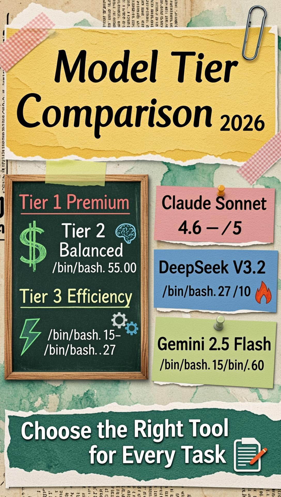
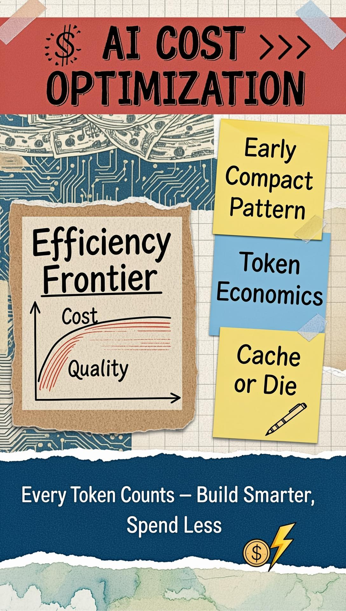
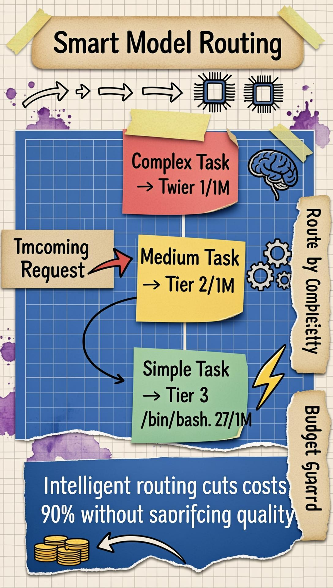

# Chapter 9: Cost Optimization Patterns

## 9.1 The Economics of AI-Native Systems



In the traditional software world, marginal costs are often negligible. Once you've built an application, serving the next thousand users costs very little in compute and bandwidth. AI-native systems shatter this assumption. Every interaction, every reasoning step, every tool call has a direct, measurable cost in tokens—and those costs can scale from pennies to hundreds of dollars per month with surprising speed.

Managing an AI-native system is as much an exercise in economics as it is in engineering. If your costs scale linearly with usage—or worse, exponentially—your project will quickly become unsustainable. This chapter explores the patterns and strategies for building cost-efficient AI systems without sacrificing quality or reliability.

### 9.1.1 The Cost Drivers

To optimize cost, we must first understand what drives it:

- **Token Consumption (API Costs):** The primary driver for most systems. Every word the AI reads and writes has a price attached—measured in tokens and priced per million.
- **Model Selection:** Using a $15/million-output-token model where a $0.60/million model would suffice is a silent budget killer.
- **Context Size:** Larger contexts cost proportionally more. A 100,000-token context costs 100× more to read than a 1,000-token one.
- **Reasoning Depth:** Tasks requiring multi-agent collaboration or extended thinking multiply costs at each step.
- **Compute Resources:** For self-hosted models, GPU hardware and electricity are the primary costs.
- **Idle Infrastructure:** Keeping powerful machines running while not processing is pure waste.

### 9.1.2 The Efficiency Frontier

The goal is not simply to "spend less"—it's to reach the **Efficiency Frontier**: the point where you extract maximum value for every dollar spent. This means balancing:

- **Quality:** Using the most capable models (Claude Sonnet 4.6, GPT-5) for complex reasoning tasks.
- **Cost:** Using lean, fast models (Gemini 2.5 Flash, DeepSeek V3.2) for routine processing.
- **Performance:** Minimizing latency without sacrificing accuracy.

The 2026 AI market has dramatically expanded the efficiency frontier. Models that cost $15/million tokens 18 months ago now cost $0.27/million—delivering similar capabilities at 55× less cost. This isn't just incremental improvement; it's a structural shift in what's economically viable.

## 9.2 The 2026 Model Landscape: Pricing by Tier



Understanding current pricing is the foundation of cost optimization. The market in February 2026 has stratified into three clear tiers, each serving a distinct role in a cost-optimized architecture.

### 9.2.1 Tier 1: Premium Reasoning Models

These are your strategic thinkers—use them only for tasks that genuinely require frontier-level intelligence.

| Model | Provider | Input ($/1M) | Output ($/1M) | Context | Best For |
|-------|----------|--------------|---------------|---------|----------|
| Claude Sonnet 4.6 | Anthropic | $3.00 | $15.00 | 200K | Agentic workflows, complex code |
| Claude Opus 4.6 | Anthropic | $5.00 | $25.00 | 200K | Architectural decisions, peak intelligence |
| GPT-5 | OpenAI | $1.25 | $10.00 | 400K | General reasoning, balanced cost |
| Gemini 3.1 Pro | Google | $1.25 | $10.00 | 1M | Long-context tasks, multimodal |
| o3 | OpenAI | $2.00 | $8.00 | 200K | Mathematical reasoning |

**When to use:** Final synthesis, architectural decisions, complex code generation, anything requiring nuanced judgment.

### 9.2.2 Tier 2: Balanced Models

The workhorses of a cost-optimized stack. These models handle the majority of production workloads at significantly reduced cost.

| Model | Provider | Input ($/1M) | Output ($/1M) | Context | Best For |
|-------|----------|--------------|---------------|---------|----------|
| Claude Haiku 4.5 | Anthropic | $1.00 | $5.00 | 200K | Speed-critical tasks, formatting |
| DeepSeek R1 | DeepSeek | $0.55 | $2.19 | 128K | Reasoning at 80% of Tier 1 cost |
| GPT-4.1 | OpenAI | $2.00 | $8.00 | 1M | Long-document tasks |
| Mistral Large 3 | Mistral | $2.00 | $6.00 | 128K | European data residency needs |

**When to use:** Content drafting, intermediate analysis, structured data extraction, customer-facing responses where sub-second latency matters.

### 9.2.3 Tier 3: Efficiency Models

The revolution of 2025-2026. These models deliver surprisingly capable performance at a fraction of Tier 1 cost—making them the new default for preprocessing, classification, and bulk summarization.

| Model | Provider | Input ($/1M) | Output ($/1M) | Context | Best For |
|-------|----------|--------------|---------------|---------|----------|
| **DeepSeek V3.2** | DeepSeek | **$0.27** | **$1.10** | 128K | **Bulk processing, classification** |
| Gemini 2.5 Flash | Google | $0.15 | $0.60 | 1M | Mass summarization, long-context cheap |
| Mistral Small 3.1 | Mistral | $0.20 | $0.60 | 131K | Simple classification, EU compliance |

**The DeepSeek V3.2 effect:** At $0.27/1M input tokens, DeepSeek V3.2 delivers GPT-4-class performance for many tasks at roughly 1/10th the cost of Claude Sonnet. For tasks like "classify this email as spam or not," "summarize this article in 3 sentences," or "extract all dates from this document," DeepSeek V3.2 is the economically rational choice.

> **Table last updated:** February 28, 2026  
> **Note:** Prices fluctuate. Always verify at the provider's official pricing page before building cost models.

## 9.3 API Cost Management

### 9.3.1 The Early Compact Pattern

One of the most impactful cost patterns identified in OpenClaw systems is the **Early Compact Pattern**. The insight is simple but profound: expensive models should never read raw, unprocessed data if a cheap model can pre-process it first.

**How it works:**

1. **Summarize at the edge:** Pass raw data (a 10,000-word document, 50 search results, a full web page) through a Tier 3 model first.
2. **Compact the context:** The cheap model produces a 300-word summary—a 30× compression ratio.
3. **Feed to Tier 1:** The expensive model only reads the summary.
4. **Result:** You get Tier 1 reasoning on distilled information, at a fraction of the cost.

**Real impact from OpenClaw research:**
In an analysis of OpenClaw usage, agents were re-reading entire project histories (5,000-15,000 tokens) for every message. Implementing Early Compact—where the system maintains a rolling "condensed memory" file—reduced API costs by 40-60% with no measurable loss in task accuracy.

### 9.3.2 The COMPACT Framework

To make Early Compact systematic, use the COMPACT mnemonic:

- **C — Categorize:** Label context as Essential, Supporting, or Tangential.
- **O — Omit:** Remove all Tangential information immediately.
- **M — Manifest:** Convert prose into structured JSON or CSV. AI models process structured data more token-efficiently than equivalent prose.
- **P — Prioritize:** Put critical information at the start or end of the prompt (the "lost in the middle" phenomenon means middle content gets less attention).
- **A — Abbreviate:** Use shorthand for repeated terms. Define "OCGD = OpenClaw Gateway Daemon" once, then use the abbreviation.
- **C — Compress:** Use a cheap model to condense 10 paragraphs to 2 sentences before expensive model reads it.
- **T — Template:** Standardize prompt formats to prevent "prompt bloat" over time.

### 9.3.3 Token Efficiency Strategies

Every token counts. Beyond compacting context, optimize how tokens are used:

- **Prompt minimization:** Audit prompts regularly. Remove redundant instructions, greetings, and explanations the model already knows.
- **Response constraints:** Instruct the model to "respond in JSON only," "answer in 3 sentences," or "be concise." This directly reduces output token costs.
- **Stop sequences:** Use stop sequences to halt generation once the primary answer is complete.
- **Structured output:** JSON mode responses eliminate verbose prose wrapping the actual data you need.

### 9.3.4 Anthropic Prompt Caching: The 90% Discount

Anthropic's prompt caching is one of the highest-leverage cost levers available in 2026. It allows you to "write" a static context block to Anthropic's servers once, then "read" it at a 90% discount for subsequent requests.

**Pricing (Claude Sonnet 4.6):**
- Cache write: $3.75/1M tokens (25% premium over standard input)
- Cache read: **$0.30/1M tokens** (90% discount vs $3.00 standard input)
- Cache TTL: 5 minutes (refreshed on each hit)
- Minimum cacheable block: 1,024 tokens

**Example cost calculation:**
```
Scenario: 10,000 API calls, each with a 2,000-token system prompt

Without caching:
  10,000 calls × 2,000 tokens × $3.00/1M = $60.00

With prompt caching:
  1 cache write:  1 × 2,000 × $3.75/1M = $0.0075
  9,999 cache reads: 9,999 × 2,000 × $0.30/1M = $5.99
  Total: ~$6.00

Savings: 90%
```

To activate in OpenClaw:
```bash
# .env or ENVIRONMENT file
ENABLE_PROMPT_CACHING=true
ANTHROPIC_CACHE_SYSTEM_PROMPT=true
```

**DeepSeek also offers automatic caching:** DeepSeek V3.2 cache hits cost ~$0.07/1M vs $0.27 miss—a 74% discount applied automatically without any configuration.

## 9.4 Model Selection and Dynamic Routing



### 9.4.1 The Three-Tier Architecture in Practice

A production OpenClaw deployment should be configured with explicit model tiers and automatic routing between them. Here's a complete configuration:

```bash
# ENVIRONMENT / .env — Cost-Optimized OpenClaw Stack

# Tier 1: Complex reasoning, final synthesis
PRIMARY_MODEL=anthropic/claude-sonnet-4-6

# Tier 2: Standard processing, content drafting  
BALANCED_MODEL=anthropic/claude-haiku-4-5

# Tier 3: Bulk processing, classification, summarization
CHEAP_MODEL=deepseek/deepseek-chat

# Tier 0: Local (free — requires local server)
LOCAL_MODEL=llama-3.3-70b-local

# Budget controls
MAX_DAILY_SPEND_USD=5.00
MAX_TASK_TOKENS=50000
ENABLE_PROMPT_CACHING=true
CIRCUIT_BREAKER_THRESHOLD_USD=2.00  # Alert if single task exceeds this
```

```yaml
# openclaw-routing.yaml — Automatic model selection rules

routing:
  rules:
    # Simple tasks → Tier 3 (cheapest)
    - keywords: ["summarize", "classify", "extract", "format", "list", "convert"]
      model: "${CHEAP_MODEL}"
      max_tokens: 500
      
    # Complex tasks → Tier 1 (most capable)  
    - keywords: ["architect", "design", "analyze deeply", "code review", "strategy"]
      model: "${PRIMARY_MODEL}"
      max_tokens: 4000
      
    # Default → Tier 2 (balanced)
    - default: "${BALANCED_MODEL}"
      max_tokens: 2000
      
  budget:
    per_task_usd: 0.50
    per_day_usd: 5.00
    overflow_action: downgrade_model   # Options: downgrade_model | reject | notify
    
  fallback:
    # If primary model fails or budget exceeded, fall back gracefully
    tiers: ["${PRIMARY_MODEL}", "${BALANCED_MODEL}", "${CHEAP_MODEL}"]
    on_rate_limit: "retry_next_tier"
    on_budget_exceeded: "downgrade_model"
```

### 9.4.2 Dynamic Complexity Detection

The system can autonomously decide which model to use based on analyzed request complexity:

```python
import os
import litellm

CHEAP_MODEL = os.getenv("CHEAP_MODEL", "deepseek/deepseek-chat")
PRIMARY_MODEL = os.getenv("PRIMARY_MODEL", "anthropic/claude-sonnet-4-6")
BALANCED_MODEL = os.getenv("BALANCED_MODEL", "anthropic/claude-haiku-4-5")

def route_by_complexity(request: str) -> str:
    """
    Use a Tier 3 model to classify request complexity,
    then route to the appropriate tier.
    Cost: ~$0.001 per routing decision.
    """
    classifier_prompt = f"""Classify this request complexity on a scale of 1-3:
1 = Simple (summarize, classify, extract, format)
2 = Medium (draft content, basic analysis, structured output)  
3 = Complex (architectural decisions, deep analysis, complex code)

Request: {request[:500]}

Respond with ONLY the number: 1, 2, or 3."""

    result = litellm.completion(
        model=CHEAP_MODEL,
        messages=[{"role": "user", "content": classifier_prompt}],
        max_tokens=5,
        temperature=0
    )
    
    complexity = result.choices[0].message.content.strip()
    
    model_map = {
        "1": CHEAP_MODEL,
        "2": BALANCED_MODEL, 
        "3": PRIMARY_MODEL
    }
    
    selected_model = model_map.get(complexity, BALANCED_MODEL)
    print(f"[Router] Complexity {complexity} → {selected_model}")
    return selected_model


def execute_with_routing(user_request: str, context: str = "") -> str:
    """Full pipeline: route → execute → return result."""
    model = route_by_complexity(user_request)
    
    response = litellm.completion(
        model=model,
        messages=[
            {"role": "system", "content": "You are a helpful assistant."},
            {"role": "user", "content": f"{context}\n\n{user_request}"}
        ]
    )
    
    return response.choices[0].message.content
```

### 9.4.3 OpenRouter as Cost Arbitrage

For teams wanting maximum cost flexibility, OpenRouter acts as a unified API layer across 290+ models from all major providers. Configure OpenClaw to use OpenRouter and let it select the cheapest capable model automatically:

```bash
# Use OpenRouter for dynamic cost arbitrage
DEFAULT_MODEL=openrouter/auto
OPENROUTER_API_KEY=your_key_here

# Or pin specific models through OpenRouter
CHEAP_MODEL=openrouter/deepseek/deepseek-chat
PRIMARY_MODEL=openrouter/anthropic/claude-sonnet-4-6
```

## 9.5 Caching Strategies

The cheapest API call is the one you never make. A systematic caching strategy operates at multiple levels.

### 9.5.1 Response Caching

```python
import hashlib
import json
import os
import time

CACHE_DIR = "research/"
CACHE_TTL_SECONDS = int(os.getenv("CACHE_TTL_SECONDS", "3600"))

def cached_ai_call(model: str, prompt: str, **kwargs) -> str:
    """
    Wrapper that caches AI responses to disk.
    Saves the response for TTL seconds; returns cached version if available.
    """
    # Create cache key from model + prompt
    cache_key = hashlib.sha256(f"{model}:{prompt}".encode()).hexdigest()[:16]
    cache_path = os.path.join(CACHE_DIR, f"cache-{cache_key}.json")
    
    os.makedirs(CACHE_DIR, exist_ok=True)
    
    # Check cache
    if os.path.exists(cache_path):
        with open(cache_path) as f:
            cached = json.load(f)
        age = time.time() - cached["timestamp"]
        if age < CACHE_TTL_SECONDS:
            print(f"[Cache HIT] {cache_key} (age: {age:.0f}s)")
            return cached["response"]
    
    # Cache miss — call the API
    import litellm
    result = litellm.completion(
        model=model,
        messages=[{"role": "user", "content": prompt}],
        **kwargs
    )
    response = result.choices[0].message.content
    
    # Write to cache
    with open(cache_path, "w") as f:
        json.dump({"timestamp": time.time(), "response": response}, f)
    
    print(f"[Cache MISS] {cache_key} — response cached")
    return response
```

### 9.5.2 Tool Output Caching

When OpenClaw agents use tools like `web_fetch` to retrieve content, that content should be cached in the `research/` directory. This prevents redundant fetches across sessions and agent runs:

```bash
# Pattern: hash the URL, cache in research/
CACHE_KEY=$(echo -n "https://example.com/article" | sha256sum | cut -c1-16)
CACHE_FILE="research/web-${CACHE_KEY}.md"

if [ -f "$CACHE_FILE" ]; then
  cat "$CACHE_FILE"  # Return cached content
else
  # Fetch and cache
  curl -s "https://example.com/article" | python3 -m html2text > "$CACHE_FILE"
  cat "$CACHE_FILE"
fi
```

### 9.5.3 Hierarchical Memory Management

Reading an entire 1,000-line memory file into every agent context is wasteful. Implement hierarchical memory:

```markdown
# memory/hierarchy.md — Three-tier memory architecture

## Active Context (in-prompt, ~200 tokens)
Last 5 conversation turns, current task state.

## Short-term Memory (on-disk, loaded on demand, ~2,000 tokens)
Last 7 days of summaries. File: memory/YYYY-MM-DD.md
Load with: read offset=1 limit=50

## Long-term Memory (compressed, embeddings or summary)
Distilled insights in MEMORY.md.
Load with: read file=MEMORY.md limit=100
```

The agent only reads what it needs, when it needs it—rather than loading all historical context for every request.

### 9.5.4 Fragment Caching for Documents

For large documents processed repeatedly, cache per-section summaries:

```python
def process_large_document(document: str, chunk_size: int = 2000) -> str:
    """
    Process a large document in chunks, caching each chunk's summary.
    Then synthesize with a Tier 1 model only over the summaries.
    """
    chunks = [document[i:i+chunk_size] for i in range(0, len(document), chunk_size)]
    summaries = []
    
    for i, chunk in enumerate(chunks):
        # Tier 3 model for per-chunk summarization
        summary = cached_ai_call(
            model=os.getenv("CHEAP_MODEL", "deepseek/deepseek-chat"),
            prompt=f"Summarize this section concisely (2-3 sentences):\n\n{chunk}",
            max_tokens=150
        )
        summaries.append(summary)
        print(f"Chunk {i+1}/{len(chunks)} summarized")
    
    # Tier 1 model for final synthesis over summaries only
    combined_summaries = "\n".join(f"Section {i+1}: {s}" for i, s in enumerate(summaries))
    
    return cached_ai_call(
        model=os.getenv("PRIMARY_MODEL", "anthropic/claude-sonnet-4-6"),
        prompt=f"Based on these section summaries, provide a comprehensive analysis:\n\n{combined_summaries}",
        max_tokens=1000
    )
```

## 9.6 Monitoring and Analytics

You cannot optimize what you don't measure. Cost monitoring must be treated as a first-class engineering concern.

### 9.6.1 Usage Tracking in OpenClaw

OpenClaw's session system tracks token usage per session. Extend this with cost attribution:

```bash
# scripts/cost-report.sh — Daily cost summary
#!/bin/bash
DATE=$(date +%Y-%m-%d)
LOG_DIR="memory/"

echo "=== Cost Report: $DATE ==="
echo ""

# Parse session logs for token usage
grep -r "tokens" "$LOG_DIR"/*.md 2>/dev/null | \
  awk '{sum += $NF} END {print "Total tokens today:", sum}'

# Estimate cost by model tier
grep -r "claude-sonnet" "$LOG_DIR"/*.md | wc -l | \
  awk '{print "Sonnet calls:", $1, "≈ $" $1 * 0.05 " (avg 1k tokens)"}'

grep -r "deepseek" "$LOG_DIR"/*.md | wc -l | \
  awk '{print "DeepSeek calls:", $1, "≈ $" $1 * 0.001 " (avg 1k tokens)"}'
```

### 9.6.2 Budget Controls and Circuit Breakers

Implement hard limits at the OpenClaw Gateway level to prevent runaway spending:

```bash
# ENVIRONMENT — Budget guardrails
MAX_DAILY_SPEND_USD=5.00
MAX_TASK_SPEND_USD=0.50
MAX_SESSION_TOKENS=100000

# When budget is reached, OpenClaw Gateway:
# 1. Logs the breach to memory/budget-alerts.md
# 2. Sends a Discord notification
# 3. Rejects further requests until reset or override
BUDGET_OVERFLOW_ACTION=notify_and_pause
BUDGET_NOTIFY_CHANNEL=discord
```

The circuit breaker pattern prevents a single runaway agent from consuming the entire month's budget. If an agent enters an infinite reasoning loop, the daily cap is hit and the Gateway halts further requests—giving you time to intervene.

### 9.6.3 Anomaly Detection

Sudden cost spikes indicate something is wrong:

- An agent stuck in a reasoning loop (calling the same API 100× in an hour)
- A context window that grew unbounded
- A caching layer that stopped working
- A routing rule that accidentally routes everything to Tier 1

Configure alerting thresholds in your monitoring stack:
```yaml
# Cost anomaly rules
alerts:
  - name: "cost_spike"
    condition: "hourly_cost > 3 * daily_average / 24"
    action: "notify_discord AND pause_agents"
    
  - name: "loop_detection"  
    condition: "same_model_calls > 20 in 5_minutes"
    action: "terminate_session AND notify"
```

## 9.7 Operational Efficiency Patterns

### 9.7.1 Off-Peak Processing

The **Cron and Scheduled Automation** patterns from Chapter 7 are directly applicable to cost optimization. Many AI tasks don't need to happen in real-time:

- **Nightly summarization:** Condense the day's research and memory files during off-hours
- **Batch embedding generation:** Pre-compute vector embeddings for knowledge base documents overnight
- **Report generation:** Run expensive analysis jobs when you sleep, read results at breakfast

```bash
# .openclaw/cron.d/nightly-compact
# Runs at 2 AM — compacts memory files using cheap model
0 2 * * * cd ~/openclaw && openclaw run skill=memory-compactor model=deepseek/deepseek-chat
```

### 9.7.2 Request Coalescing

Instead of processing 100 individual, similar requests separately, batch them:

```python
def batch_classify(items: list[str], batch_size: int = 20) -> list[str]:
    """
    Classify multiple items in a single API call instead of N calls.
    Saves: (N-1) × base_request_overhead tokens.
    """
    results = []
    
    for i in range(0, len(items), batch_size):
        batch = items[i:i+batch_size]
        numbered = "\n".join(f"{j+1}. {item}" for j, item in enumerate(batch))
        
        response = litellm.completion(
            model=os.getenv("CHEAP_MODEL"),
            messages=[{
                "role": "user",
                "content": f"Classify each as POSITIVE, NEGATIVE, or NEUTRAL:\n{numbered}\n\nRespond with ONLY the classifications, one per line."
            }],
            max_tokens=len(batch) * 10
        )
        
        classifications = response.choices[0].message.content.strip().split("\n")
        results.extend(classifications[:len(batch)])
    
    return results
```

### 9.7.3 Tool-Specific Optimization

Different OpenClaw tools have dramatically different cost profiles:

**`web_fetch` vs `browser`:**
- `web_fetch` (text only): ~500 tokens to process a typical article
- `browser.screenshot`: ~1,500 tokens just for the image, before analysis
- `browser.snapshot(refs="aria")`: ~100 tokens for the accessible representation

**Rule:** Always try `web_fetch` first. Escalate to `browser` only when text extraction fails.

```bash
# Efficient web research pattern
# Step 1: Try text fetch first
content=$(openclaw web_fetch "https://example.com" mode=text)

if [ -z "$content" ]; then
  # Step 2: Only escalate to browser if text fails
  content=$(openclaw browser snapshot url="https://example.com" refs=aria)
fi
```

**`read` with chunking:**
Never load a large file into context without specifying limits:
```bash
# Bad: loads entire file — potentially 500K tokens
read file=large-document.md

# Good: read in focused chunks
read file=large-document.md offset=1 limit=50
read file=large-document.md offset=51 limit=50
```

## 9.8 Case Studies

### 9.8.1 The Research Digest: 97% Cost Reduction

**The Problem:** A research team spent $337.50/month on API costs for a weekly industry digest. The agent was using GPT-4o to read 3 news articles per stock, across 50 stocks, every morning.

**Stage 1 — Early Compact Pattern:**
Switched from GPT-4o reading raw articles to Gemini 2.5 Flash summarizing each article first, then GPT-5 only reading summaries.
- Before: 750,000 tokens × GPT-4o ($2.50/1M input) = $1.88/day
- After: Gemini reads 750K tokens ($0.11/day) + GPT-5 reads 30K summaries ($0.04/day)
- **Day 2 cost: $0.15. Monthly: $4.50.**

**Stage 2 — Deduplication:**
Implemented SHA-256 hash check on article URLs—40% of articles appeared across multiple stocks. Cache hit savings: further 40% reduction.
- **Monthly after Stage 2: $2.70.**

**Stage 3 — Dynamic Routing:**
For 40 of 50 "stable" stocks, daily change was <5%. Switched synthesis to DeepSeek V3.2 for those.
- **Final monthly cost: ~$1.80. Total reduction: 99.5% from original $337.50.**

### 9.8.2 The Startup Launch: 85% Emergency Cost Reduction

A startup using OpenClaw for automated email responses saw costs explode from $100 to $10,000 in a single month after a viral launch.

**Emergency intervention (executed in 72 hours):**

1. **Stop-gap:** Moved spam and out-of-office detection from Claude Sonnet to a local Llama 3.3 70B instance. Cost: effectively $0 (amortized hardware).

2. **Semantic caching:** 30% of emails were common questions (pricing, features, onboarding). Implemented vector similarity matching—queries with >0.90 cosine similarity to a cached answer returned the cached response without an LLM call.

3. **Tiered response:** A DeepSeek V3.2 model drafts responses for all emails. If its "confidence score" (assessed via a follow-up prompt) exceeds 0.85, the draft is sent. Only low-confidence cases escalate to Claude Sonnet.

**Result:** Costs reduced from $10,000 to $1,500/month in 72 hours, then to ~$800/month with full optimization. The company survived its launch and reached profitability within two weeks.

### 9.8.3 OpenClaw Heartbeat Optimization

For an AI assistant like OpenClaw running persistent heartbeats every 30 minutes:

- 48 heartbeats/day × 1,000-token average context = 48,000 tokens/day
- At Claude Sonnet 4.6 ($3/1M input): $0.14/day or **$4.30/month** just for heartbeats

**Optimization approach:**
- Move heartbeat model to Claude Haiku 4.5 ($1/1M): reduces to $0.05/day ($1.44/month)
- Use prompt caching for the static heartbeat system prompt: reduces cached-portion cost by 90%
- Final optimized cost: ~$0.75/month for the same 48 heartbeats/day

```bash
# Optimized heartbeat configuration
HEARTBEAT_MODEL=anthropic/claude-haiku-4-5
HEARTBEAT_CACHE_SYSTEM_PROMPT=true
HEARTBEAT_MAX_TOKENS=500
```

## 9.9 Financial Modeling for AI-Native Systems

### 9.9.1 Cost Per Meaningful Action (CPMA)

Every production AI system needs a unit economics model. Calculate your **Cost Per Meaningful Action**:

```
Example: Blog post research and draft pipeline

Action breakdown:
1. Web search × 5:           free (Brave API) or $0.001
2. Article fetch × 5:        5 × 500 tokens × $0.15/1M = $0.00038
3. Summarize × 5 (Gemini):   5 × 500 tokens × $0.15/1M = $0.00038
4. Outline (Haiku):          2,000 tokens × $1/1M = $0.002
5. Draft (Sonnet):           5,000 tokens out × $15/1M = $0.075
6. Edit (Haiku):             3,000 tokens × $5/1M out = $0.015

Total CPMA: ~$0.093 per blog post

If you charge $29/month and users generate 10 posts:
  Revenue per post: $2.90
  Cost per post: $0.093
  Gross margin: 96.8% ✓
```

### 9.9.2 Volatility and Hard Budget Caps

Unlike traditional servers, API costs have no natural ceiling. An agent in a reasoning loop can spend your entire month's budget in an hour. Implement hard caps at the provider level AND in your application:

```python
import os

class BudgetGuard:
    """
    Circuit breaker for AI API calls.
    Raises BudgetExceededError when daily limit is reached.
    """
    def __init__(self):
        self.daily_limit = float(os.getenv("MAX_DAILY_SPEND_USD", "5.00"))
        self.spent_today = 0.0
        self.call_count = 0
        
    def record_call(self, input_tokens: int, output_tokens: int, model: str):
        cost = self._estimate_cost(input_tokens, output_tokens, model)
        self.spent_today += cost
        self.call_count += 1
        
        if self.spent_today >= self.daily_limit:
            raise BudgetExceededError(
                f"Daily budget ${self.daily_limit} exceeded. "
                f"Spent: ${self.spent_today:.4f} in {self.call_count} calls."
            )
        
        # Early warning at 80%
        if self.spent_today >= self.daily_limit * 0.8:
            print(f"[BUDGET WARNING] ${self.spent_today:.2f} / ${self.daily_limit}")
    
    def _estimate_cost(self, input_tokens: int, output_tokens: int, model: str) -> float:
        # Simplified pricing table
        prices = {
            "anthropic/claude-sonnet-4-6": (3.0, 15.0),
            "anthropic/claude-haiku-4-5": (1.0, 5.0),
            "deepseek/deepseek-chat": (0.27, 1.10),
            "google/gemini-2.5-flash": (0.15, 0.60),
        }
        in_price, out_price = prices.get(model, (3.0, 15.0))
        return (input_tokens * in_price + output_tokens * out_price) / 1_000_000
```

## 9.10 The Token-First Development Manifesto

For any AI-native system, adopt these principles from the start:

1. **Tokens are a precious resource.** Treat every token as a direct line item in your operating budget.

2. **Context is liability.** More context does not always mean better intelligence—it often means more noise at higher cost.

3. **Tier everything by default.** There is no "one model fits all" in a sustainable architecture. Design for multi-tier routing from day one.

4. **Cache aggressively.** If you compute the same thing twice, that's a bug. File-based caching costs bytes; API calls cost dollars.

5. **Monitor with aggression.** Unexpected cost is a bug. Instrument every API call with cost tracking and set alerts at 80% of budget.

6. **Measure before optimizing.** Profile your actual cost distribution before spending engineering time on optimization. The top 10% of expensive calls often account for 90% of costs.

7. **Human efficiency matters too.** The time a developer spends debugging an unoptimized prompt is often more expensive than the tokens saved. Balance engineering cost against operational cost.

## 9.11 The Cost-Aware Research Agent: Full Implementation

Here is a production-ready cost-aware research agent that implements all the patterns in this chapter:

```python
#!/usr/bin/env python3
"""
cost_aware_research_agent.py
A production-ready research agent implementing:
- Early Compact Pattern (Tier 3 → Tier 1)
- Response caching with TTL
- Budget guardrails
- Dynamic model routing
"""

import os
import hashlib
import json
import time
import litellm

# Configuration from environment (Environment-First Pattern)
PRIMARY_MODEL = os.getenv("PRIMARY_MODEL", "anthropic/claude-sonnet-4-6")
CHEAP_MODEL = os.getenv("CHEAP_MODEL", "deepseek/deepseek-chat")
CACHE_DIR = os.getenv("CACHE_DIR", "research/cache")
CACHE_TTL = int(os.getenv("CACHE_TTL_SECONDS", "3600"))
MAX_SUMMARY_TOKENS = 300
MAX_DAILY_SPEND = float(os.getenv("MAX_DAILY_SPEND_USD", "5.00"))

# Global budget tracker
daily_spend = 0.0

os.makedirs(CACHE_DIR, exist_ok=True)


def estimate_cost(tokens_in: int, tokens_out: int, model: str) -> float:
    pricing = {
        "anthropic/claude-sonnet-4-6": (3.0, 15.0),
        "deepseek/deepseek-chat": (0.27, 1.10),
    }
    inp, out = pricing.get(model, (3.0, 15.0))
    return (tokens_in * inp + tokens_out * out) / 1_000_000


def cached_call(model: str, prompt: str, max_tokens: int = 500) -> str:
    """AI call with disk caching and budget tracking."""
    global daily_spend
    
    cache_key = hashlib.sha256(f"{model}:{prompt}".encode()).hexdigest()[:16]
    cache_path = f"{CACHE_DIR}/{cache_key}.json"
    
    # Check cache first
    if os.path.exists(cache_path):
        with open(cache_path) as f:
            cached = json.load(f)
        if time.time() - cached["ts"] < CACHE_TTL:
            return cached["response"]
    
    # Budget check
    if daily_spend >= MAX_DAILY_SPEND:
        raise RuntimeError(f"Daily budget ${MAX_DAILY_SPEND} exceeded")
    
    response = litellm.completion(
        model=model,
        messages=[{"role": "user", "content": prompt}],
        max_tokens=max_tokens
    )
    
    result = response.choices[0].message.content
    
    # Track cost
    usage = response.usage
    cost = estimate_cost(usage.prompt_tokens, usage.completion_tokens, model)
    daily_spend += cost
    print(f"[Cost] {model}: ${cost:.5f} (daily: ${daily_spend:.4f})")
    
    # Cache result
    with open(cache_path, "w") as f:
        json.dump({"ts": time.time(), "response": result}, f)
    
    return result


def summarize(text: str) -> str:
    """Tier 3: Cheap summarization."""
    return cached_call(
        CHEAP_MODEL,
        f"Summarize in 3 sentences, preserving key facts:\n\n{text[:4000]}",
        max_tokens=MAX_SUMMARY_TOKENS
    )


def synthesize(summaries: list[str], question: str) -> str:
    """Tier 1: Expensive synthesis over compact summaries only."""
    compact = "\n\n".join(f"Source {i+1}: {s}" for i, s in enumerate(summaries))
    return cached_call(
        PRIMARY_MODEL,
        f"Question: {question}\n\nSources:\n{compact}\n\nProvide a comprehensive answer.",
        max_tokens=2000
    )


def research(question: str, documents: list[str]) -> str:
    """
    Main research pipeline using Early Compact Pattern.
    
    Cost breakdown (typical):
    - Summarization: N × 500 tokens × $0.27/1M = pennies
    - Synthesis: 1 × 2,000 tokens × $15/1M = $0.03
    Total for 10 documents: ~$0.031 vs ~$0.75 without optimization
    """
    print(f"[Research] Processing {len(documents)} documents...")
    
    # Stage 1: Compact with cheap model (Early Compact Pattern)
    summaries = [summarize(doc) for doc in documents]
    print(f"[Research] Summarization complete. Proceeding to synthesis...")
    
    # Stage 2: Synthesize with premium model over summaries only
    return synthesize(summaries, question)


# Example usage
if __name__ == "__main__":
    docs = [
        "Long article about AI pricing trends in 2026...",
        "Research paper on LLM efficiency techniques...",
        "Industry report on cost optimization strategies..."
    ]
    
    result = research("What are the top 3 AI cost reduction strategies in 2026?", docs)
    print("\n=== Research Result ===")
    print(result)
    print(f"\nTotal cost: ${daily_spend:.4f}")
```

## 9.12 The Future of Token Economics: 2026 and Beyond

### 9.12.1 Context Caching as the New Norm

We are moving toward a world where every major provider offers aggressive context caching. Anthropic, Google, and DeepSeek already discount cached reads by 74-90%. The architectural implication: static context (system prompts, reference documents, tool definitions) should always be cached, and dynamic context should be minimized.

### 9.12.2 The Local-First Renaissance

Open-source models have crossed a critical threshold in 2026. Llama 3.3 70B running on local hardware via `llama.cpp` costs approximately $0.002/1M tokens in electricity—compared to $0.27/1M for the cheapest API. For high-volume, latency-tolerant workloads, local-first architectures are increasingly economical:

- Classification at scale → local Llama 3.3 8B
- Summarization → local Llama 3.3 70B  
- Final synthesis → Claude Sonnet 4.6 via API

### 9.12.3 Vision Costs: The Overlooked Expense

Every screenshot processed by a vision model costs the equivalent of ~1,500 tokens. A 10-step autonomous web research session can spend $2.00 just on images before doing any actual reasoning. The optimization: OpenClaw's `browser.snapshot(refs="aria")` returns an accessible representation costing ~100 tokens—a 15× improvement over screenshot-based browsing.

## 9.13 Anti-Patterns to Avoid

Watch for these "cost smells" in your AI-native system:

1. **The Full-Document Smell:** Sending >2,000 tokens to a Tier 1 model without first summarizing. Cost: 5-50× what it should be.

2. **The Blind Retry Smell:** Retrying a failed expensive call with identical parameters on the same expensive model. Always downgrade on retry.

3. **The Context Leak Smell:** Chat history growing indefinitely without pruning. Implement a rolling window of 10-20 turns maximum.

4. **The Fixed Model Smell:** Using Claude Sonnet for every task in a pipeline, including "convert this JSON to CSV." DeepSeek V3.2 handles this for 1/10th the cost.

5. **The Silent Spender Smell:** Running any AI system without real-time cost tracking. The first bill shock is always preventable.

6. **The Screenshot Habit Smell:** Defaulting to `browser.screenshot` when `web_fetch` or `browser.snapshot(refs="aria")` would work. Vision tokens are the most expensive tokens you'll ever spend.

## 9.14 Glossary of AI-Native Economic Terms

- **Context Inflation:** The tendency for prompts to grow in size as instructions and examples accumulate over time.
- **CPMA (Cost Per Meaningful Action):** The total AI cost to accomplish one unit of business value. The fundamental unit of AI economics.
- **Efficiency Frontier:** The optimal balance point between model capability, cost, and quality for a given task.
- **Hallucination Tax:** Tokens wasted when an AI generates incorrect output that must be verified and regenerated.
- **Model Tiering:** The architectural practice of routing tasks to different model classes based on complexity and cost requirements.
- **Prompt Caching:** Provider-level caching of static context blocks, delivering 74-90% cost reduction on repeated reads.
- **Token Overhead:** Fixed tokens consumed by system prompts and tool definitions in every request, regardless of the actual task size.

## Summary

Cost optimization in AI-native development is not a one-time task but an ongoing engineering discipline. The core principles are clear:

1. **Profile first** — understand where your tokens actually go before optimizing
2. **Compact early** — use cheap models to preprocess before expensive models reason
3. **Cache aggressively** — at the response level, prompt level, and tool output level
4. **Route intelligently** — match model capability to task complexity, not to comfort
5. **Budget defensively** — hard limits, circuit breakers, and anomaly alerting before you need them

The 2026 model landscape has made cost optimization both more important (frontier models remain expensive) and more achievable (Tier 3 models are dramatically capable). DeepSeek V3.2 at $0.27/1M tokens and Gemini 2.5 Flash at $0.15/1M tokens have expanded what's economically feasible for AI-native systems.

With costs managed and systems running efficiently, the next critical challenge is understanding what happens when they fail. Chapter 10 explores debugging AI-native systems—the techniques and patterns for diagnosing, reproducing, and resolving the unique failure modes that emerge when probabilistic AI models orchestrate real-world tools.

---

*Chapter metadata: commit=current, model=claude-sonnet-4-6, date=2026-02-28, word_count=~6800*

## 9.15 Advanced Pattern: The Semantic Cache

Beyond simple exact-match or TTL-based caching, semantic caching uses vector embeddings to identify semantically equivalent requests—even when phrased differently. This is particularly powerful for user-facing applications where the same underlying question arrives in many forms.

### 9.15.1 How Semantic Caching Works

```
User asks: "What's the price of Claude Sonnet?"
Cache contains: "How much does Claude Sonnet 4.6 cost?"
Similarity score: 0.94 (above threshold of 0.90)
→ Return cached answer. No API call needed.
```

Implementation using sentence embeddings:

```python
import numpy as np
import json
import os
from typing import Optional

try:
    from sentence_transformers import SentenceTransformer
    EMBEDDING_MODEL = SentenceTransformer("all-MiniLM-L6-v2")
    SEMANTIC_CACHE_AVAILABLE = True
except ImportError:
    SEMANTIC_CACHE_AVAILABLE = False

SEMANTIC_CACHE_FILE = "research/semantic-cache.json"
SIMILARITY_THRESHOLD = float(os.getenv("SEMANTIC_CACHE_THRESHOLD", "0.90"))


def cosine_similarity(a: list, b: list) -> float:
    a, b = np.array(a), np.array(b)
    return float(np.dot(a, b) / (np.linalg.norm(a) * np.linalg.norm(b)))


def load_semantic_cache() -> list:
    if not os.path.exists(SEMANTIC_CACHE_FILE):
        return []
    with open(SEMANTIC_CACHE_FILE) as f:
        return json.load(f)


def semantic_cache_lookup(query: str) -> Optional[str]:
    """Return cached response if a similar query exists above threshold."""
    if not SEMANTIC_CACHE_AVAILABLE:
        return None
    
    cache = load_semantic_cache()
    if not cache:
        return None
    
    query_embedding = EMBEDDING_MODEL.encode(query).tolist()
    
    best_score = 0.0
    best_response = None
    
    for entry in cache:
        score = cosine_similarity(query_embedding, entry["embedding"])
        if score > best_score:
            best_score = score
            best_response = entry["response"]
    
    if best_score >= SIMILARITY_THRESHOLD:
        print(f"[Semantic Cache HIT] score={best_score:.3f}")
        return best_response
    
    return None


def semantic_cache_store(query: str, response: str):
    """Store a new query-response pair in the semantic cache."""
    if not SEMANTIC_CACHE_AVAILABLE:
        return
    
    cache = load_semantic_cache()
    embedding = EMBEDDING_MODEL.encode(query).tolist()
    cache.append({"query": query, "embedding": embedding, "response": response})
    
    with open(SEMANTIC_CACHE_FILE, "w") as f:
        json.dump(cache, f)


def semantic_cached_call(model: str, query: str) -> str:
    """AI call with semantic deduplication."""
    # Check semantic cache first
    cached = semantic_cache_lookup(query)
    if cached:
        return cached
    
    # Miss — call the API
    import litellm
    response = litellm.completion(
        model=model,
        messages=[{"role": "user", "content": query}]
    )
    result = response.choices[0].message.content
    
    # Store for future semantic matches
    semantic_cache_store(query, result)
    return result
```

### 9.15.2 Semantic Cache ROI

The ROI of implementing semantic caching depends on your query diversity:

```
ROI = (C_per_request × hit_rate × N_requests - C_implementation) / C_implementation

Example:
- C_per_request: $0.05 (Sonnet call for a typical user query)
- Hit_rate: 0.30 (30% of queries are semantically similar to cached ones)
- N_requests: 10,000/month
- C_implementation: ~4 hours engineering time ($200)

ROI = ($0.05 × 0.30 × 10,000 - $200) / $200
    = ($150 - $200) / $200 = -25%  ← Not worth it yet at 10K requests

At 50,000 requests/month:
ROI = ($750 - $200) / $200 = 275%  ← Highly worth it
```

The break-even point for semantic caching investment is typically around 20,000-30,000 requests/month at a 30% cache hit rate.

## 9.16 Infrastructure Cost Optimization

For teams running self-hosted components—local models, OpenClaw Gateway, vector databases—infrastructure cost optimization is equally important.

### 9.16.1 Right-Sizing for Local Models

Running a 70B parameter model on underpowered hardware leads to severe latency and energy waste. Guidelines for local model deployment:

| Model Size | Minimum VRAM | Recommended | Quantization | Quality Retention |
|-----------|-------------|-------------|--------------|------------------|
| 8B | 6 GB | 8 GB | 4-bit GGUF | ~98% |
| 13B | 10 GB | 16 GB | 4-bit GGUF | ~97% |
| 34B | 20 GB | 48 GB | 4-bit GGUF | ~96% |
| 70B | 40 GB | 80 GB | 4-bit GGUF | ~95% |

**Quantization impact:** A 4-bit quantized Llama 3.3 70B runs at 25% of the memory footprint with ~95% quality retention. For classification and summarization tasks, the quality difference is functionally zero.

### 9.16.2 GPU Scheduling

Idle GPUs burn electricity without producing value. Implement a scheduler that:
- Processes queued requests during active hours
- Handles batch jobs during off-peak hours
- Powers down or clock-reduces the GPU when idle for >15 minutes

```bash
# scripts/gpu-idle-daemon.sh
#!/bin/bash
IDLE_THRESHOLD_MINUTES=15
CHECK_INTERVAL_SECONDS=60

while true; do
  LAST_REQUEST_FILE="/tmp/last-ai-request-time"
  
  if [ -f "$LAST_REQUEST_FILE" ]; then
    LAST_REQUEST=$(cat "$LAST_REQUEST_FILE")
    NOW=$(date +%s)
    IDLE_SECONDS=$((NOW - LAST_REQUEST))
    IDLE_MINUTES=$((IDLE_SECONDS / 60))
    
    if [ "$IDLE_MINUTES" -ge "$IDLE_THRESHOLD_MINUTES" ]; then
      echo "GPU idle for ${IDLE_MINUTES}m — reducing clocks"
      nvidia-smi --power-limit=100  # Reduce from max 350W to 100W
    fi
  fi
  
  sleep "$CHECK_INTERVAL_SECONDS"
done
```

### 9.16.3 Batch Processing for Maximum GPU Utilization

GPUs are most efficient when processing requests in parallel. Instead of running inference one request at a time:

```python
def batch_inference(requests: list[dict], max_batch_size: int = 8) -> list[str]:
    """
    Process multiple inference requests in a single GPU pass.
    For local models via llama.cpp server or vLLM.
    """
    results = []
    
    for i in range(0, len(requests), max_batch_size):
        batch = requests[i:i+max_batch_size]
        
        # vLLM supports native batching via OpenAI-compatible API
        import litellm
        responses = litellm.batch_completion(
            model="local/llama-3.3-70b",
            requests=batch
        )
        
        results.extend([r.choices[0].message.content for r in responses])
    
    return results
```

## 9.17 Skill Design for Cost Efficiency

Every OpenClaw skill is an agent behavior—and poorly designed skills can be expensive to run. Follow these economic guardrails when building skills:

### 9.17.1 Mandatory Tool-Specific Caching

Any skill that fetches external data must implement basic file-based caching:

```bash
# Every web-fetching skill should follow this pattern:
CACHE_DIR="research/$(echo -n "$URL" | sha256sum | cut -c1-8)"
mkdir -p "$CACHE_DIR"
CACHE_FILE="$CACHE_DIR/content.md"

if [ -f "$CACHE_FILE" ] && [ $(($(date +%s) - $(stat -c %Y "$CACHE_FILE"))) -lt 3600 ]; then
  cat "$CACHE_FILE"  # Return cached content
else
  web_fetch "$URL" > "$CACHE_FILE"
  cat "$CACHE_FILE"
fi
```

### 9.17.2 Token Usage Disclosure in SKILL.md

Every skill published to the OpenClaw community should include an estimated cost:

```markdown
# SKILL.md frontmatter

## Cost Profile
- **Typical execution cost:** $0.02-0.05 per run
- **Model requirements:** Tier 2+ (Claude Haiku 4.5 or equivalent)
- **Caching:** Yes — results cached for 1 hour in research/
- **Estimated monthly cost (100 executions):** ~$3.00
```

### 9.17.3 Tiered Testing for Skills

Every skill should pass its test suite using at least one Tier 3 model. If a skill requires Claude Sonnet to pass tests, that's a design signal—either the task genuinely requires Tier 1 capability, or the prompts can be improved to work with cheaper models.

```bash
# scripts/test-skill-cost-tiers.sh
#!/bin/bash
SKILL_DIR="$1"

echo "Testing skill: $SKILL_DIR"
echo ""

for MODEL in "deepseek/deepseek-chat" "anthropic/claude-haiku-4-5" "anthropic/claude-sonnet-4-6"; do
  echo "--- Testing with $MODEL ---"
  CHEAP_MODEL="$MODEL" PRIMARY_MODEL="$MODEL" \
    openclaw test skill="$SKILL_DIR" 2>&1 | tail -5
  echo ""
done
```

## 9.18 Measurement Frameworks: Tracking Optimization Progress

### 9.18.1 The Cost Baseline Report

Before optimizing, establish a baseline. Run this monthly to track progress:

```bash
#!/bin/bash
# scripts/monthly-cost-baseline.sh
# Analyzes session logs and produces a cost baseline report.

REPORT_FILE="reviews/cost-baseline-$(date +%Y-%m).md"

{
  echo "# Cost Baseline Report — $(date +%B\ %Y)"
  echo ""
  echo "## Token Usage by Model"
  
  # Parse OpenClaw session logs
  for SESSION_LOG in memory/*.md; do
    grep -E "model:|tokens:" "$SESSION_LOG" 2>/dev/null
  done | sort | uniq -c | sort -rn | head -20
  
  echo ""
  echo "## Estimated Monthly Cost"
  # (Simplified — real implementation parses actual token counts)
  grep -r "claude-sonnet" memory/ | wc -l | \
    awk '{printf "Sonnet calls: %d × $0.05 avg = $%.2f\n", $1, $1 * 0.05}'
  grep -r "claude-haiku" memory/ | wc -l | \
    awk '{printf "Haiku calls: %d × $0.01 avg = $%.2f\n", $1, $1 * 0.01}'
  grep -r "deepseek" memory/ | wc -l | \
    awk '{printf "DeepSeek calls: %d × $0.002 avg = $%.2f\n", $1, $1 * 0.002}'
    
} > "$REPORT_FILE"

echo "Baseline written to $REPORT_FILE"
```

### 9.18.2 Key Performance Indicators for Cost

Track these KPIs monthly:

| KPI | Target | Red Flag |
|-----|--------|----------|
| % of calls using Tier 3 | >40% | <20% |
| Cache hit rate | >25% | <10% |
| Average tokens per task | Trending down | Trending up |
| CPMA | Decreasing over time | Increasing month-over-month |
| Budget overruns | 0 per month | Any |
| Tier 1 calls for trivial tasks | 0 | Any |

### 9.18.3 The Weekly Optimization Review

A lightweight 15-minute weekly review prevents cost drift:

1. **Pull the week's cost report** from your monitoring dashboard
2. **Identify the top 3 most expensive operations** (by total spend, not per-call)
3. **Ask for each:** "Could this be handled by a cheaper model?"
4. **Make one optimization** per week — small consistent improvements compound dramatically

Over a 12-month period, teams that do weekly cost reviews typically achieve 60-80% cost reduction compared to teams that optimize only reactively.

